# Jeopardy software

## Overview

Software to run a Jeopardy quiz game.

Click to expand an introduction to Jeopardy for readers who have not heard of it

[Jeopardy](https://en.wikipedia.org/wiki/Jeopardy!) is a TV quiz game show. You can get some idea of what it's like by watching videos on [the official Jeopardy youtube channel](https://www.youtube.com/@jeopardy/videos). There are three players and one host. All the players see a table of clues organized into categories and dollar values. One player chooses a clue, then the host reads the question, then all players can press a button to say an answer.

One person, who I call the *operator*, hosts the game, which means they read questions out loud and judge whether responses are correct. Any number of players split into teams then use buzzers to answer questions.

The game is played with people in the same physical room; it is not a network multiplayer game.

This software uses two web browser windows: The *operator window* reveals correct answers so it is only visible to the human operator. The *presentation window* shows questions to all the players. I use a laptop for the operator window and a big TV for the presentation window.

I made [buzzers](https://github.com/pfroud/jeopardy-buzzer-controller) specifically to use with this software, but any USB keyboard (like a QWERTY keyboard not a music keyboard) also works.

## Project history

In 2018, I was inspired by Tom Scott's YouTube game show [Lateral](https://www.youtube.com/playlist?list=PL96C35uN7xGLZj-FTNfZYmo3uv6-MJ0D-) to create a trivia series for [Silicon Valley Offbeat Fun](https://www.meetup.com/Offbeat-Fun). (The original Lateral video series is now unlisted on YouTube probably to avoid confusion with its successor, a [weekly podcast of the same name](https://lateralcast.com).)

I wanted to be able to switch between hosting the game and being a player. That meant I needed questions which I didn't know the answers to. After researching sources of pre-made trivia question, it was clear that the best were from Jeopardy. Thanks to a devoted fanbase, more than 500,000 questions from nearly 40 years on air are available online at [J Archive](https://j-archive.com).

I began the project using [JService](https://github.com/sottenad/jService), a web API to J Archive, which gave responses in JSON. Since Javascript was the quickest JSON parser to set up, I started writing the game with Javascript in a web browser. JService shut down in December 2023 but to this day the project is based on HTML and Javascript. Questions now come directly from J Archive with a few steps of copying and pasting.

## Operator window

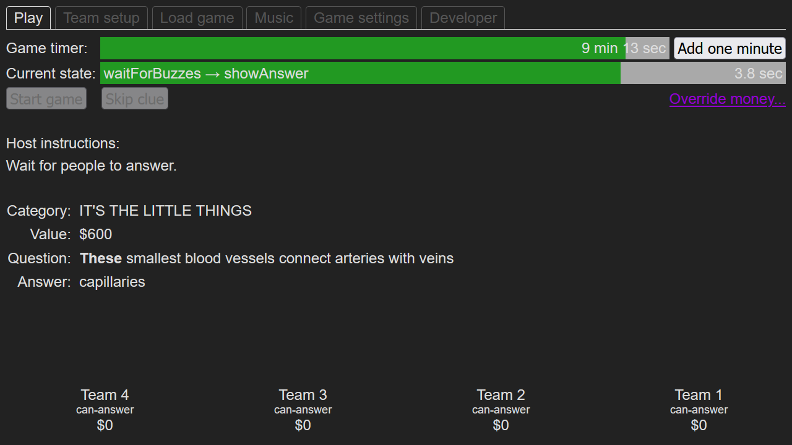

The operator window is only visible to the person operating the game. In a utilitarian design, this window shows the question *and* answer.

A distinctive feature of Jeopardy is that players can only buzz in after the host finishes reading the question out loud. The buzzers are disabled while the host is speaking. On the TV show, an offscreen crew member presses a button to turn on the buzzers when the host finishes reading (see [How Does the Jeopardy Buzzer Work](https://www.jeopardy.com/jbuzz/behind-scenes/how-does-jeopardy-buzzer-work)). In my game, the operator reads the question from the operator window then presses the spacebar to enable the buzzers.

Next, players press their buzzer and say an answer out loud. The human operator judges if spoken answers are close enough to the answer shown in the operator window. Most of the time it's clear whether an answer is acceptable, but if not the operator can briefly pause the game to look stuff up. For example once we had to  check if "fluorescence" is the same as "phosphorescence".

The operator window runs all the game logic: state machine, keyboard listeners, countdown timers, scorekeeping, etc. Extra controls are separated into tabs:

- Team setup - change how many teams are in play, and set custom team names.
- Load game - load a game from `localStorage`, which is saved automatically.
- Music - play opening and closing music.
- Game settings - adjust some values, for example the time limit for teams to answer after buzzing in.
- Developer - for example, buttons to manually change the state machine state.

The clue in the above screenshot is from the [last game hosted by Alex Trebek](https://j-archive.com/showgame.php?game_id=6900).

## Presentation window

<table>
  <tr>
    <td>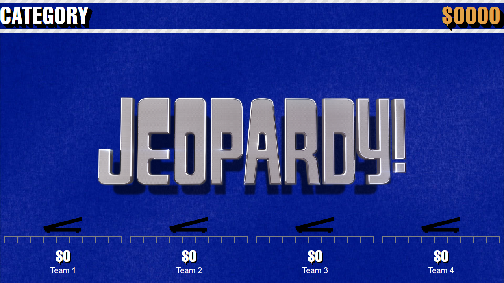</td>
    <td>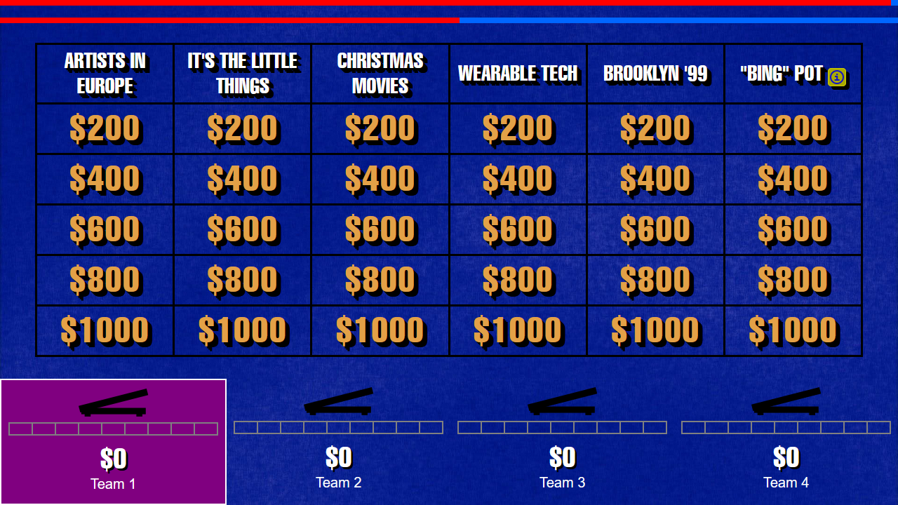</td>
    <td>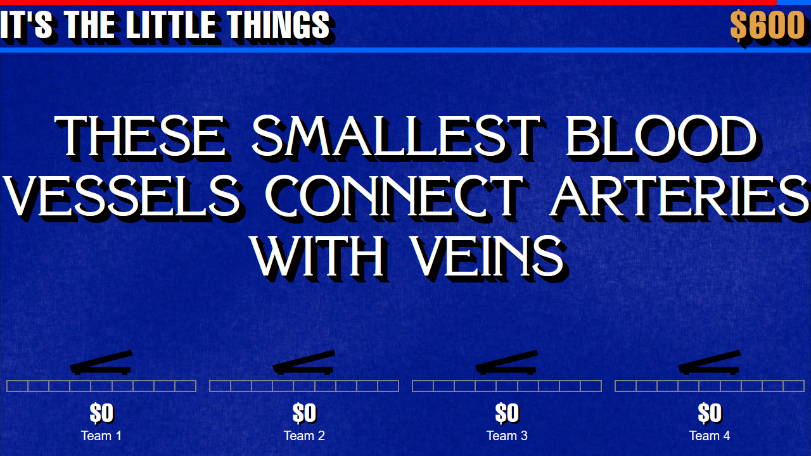</td>
    </tr>
</table>

The presentation window shows questions to all the players, ideally on a big TV. The fonts, colors, shadows, and background are styled after the TV show.

The screenshots above show what it looks like. From left to right:

- Before a game has started, the presentation window sets the stage with the Jeopardy logo.
- Showing the table of available clues. A flashing purple background on Team 1 indicates it's their turn to pick the next clue to reveal.
- Showing the question.

At the top of the presentation window, two red bars display the remaining time for two countdown timers. At the very top is the time left in the entire game round, and below that is the time left for the item currently being shown on screen.

At the bottom of the presentation window, each team has:

- An icon of the [metal footswitch used for the buzzer](https://github.com/pfroud/jeopardy-buzzer-controller?tab=readme-ov-file#buzzers), which gives visual feedback to players that the software sees their buzzer being pressed. Before this feature was added, some players felt like their buzzer wasn't working; this icon lets everyone test their buzzer at any time during the game.
- A segmented countdown bar [copied from the TV show](https://www.youtube.com/watch?v=cGSDLZ5wqy8&t=10s) for the five-second timer to say an answer after buzzing in.

Here's a video of the footswitch icon and segmented countdown bar in use:

<!--
To get a video player to appear in a markdown file, you need to drag-and-drop the
video file into the github.com code editor gui. I don't think you can make a video
player using a video file committed to the repository.
-->
https://github.com/user-attachments/assets/ef83fba0-1115-4bd3-b27f-d7f64035db71

The categories and selected clue in the above screenshots are from the [last game hosted by Alex Trebek](https://j-archive.com/showgame.php?game_id=6900).

## Startup sequence

To set up two web browser windows which communicate with each other, the user opens the operator window which automatically opens the presentation window:

<!-- https://mermaid.js.org/syntax/sequenceDiagram.html -->
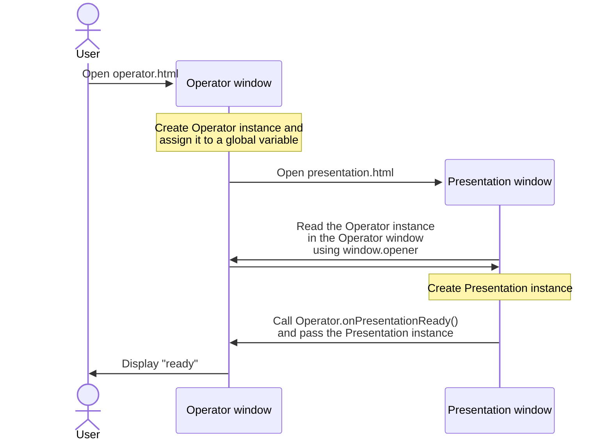

The way I'm doing it is bad in Typescript because [type assertions](https://www.typescriptlang.org/docs/handbook/2/everyday-types.html#type-assertions) (the `as` keyword) are needed in two places:

- Adding a global variable in the operator window:  
  `(window as any).operator = new Operator();`
- Accessing the Operator instance from the presentation window:  
  `const operator = (window.opener as any).operator as Operator;`

I tried refactoring to avoid these by using the return value of `window.open()` but it did not work. See [my open Stack Overflow question](https://stackoverflow.com/questions/79232362)!

## State machine

The entire game is run by this state machine:

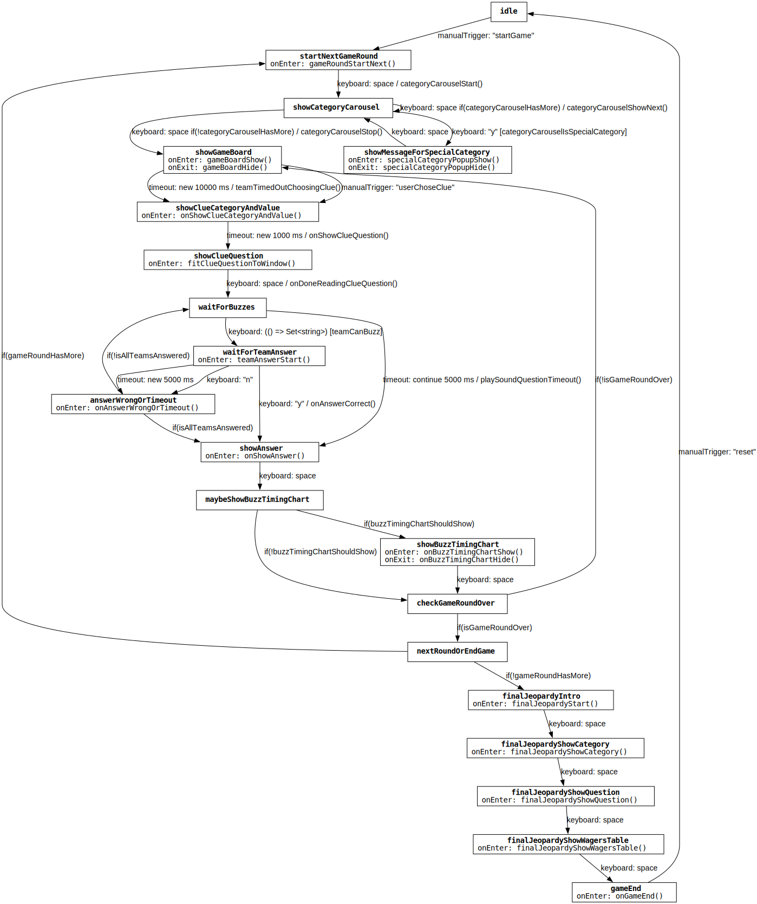

How to read the transition labels: text is always to the right of the arrow (troublesome in a few places). Each label contains up to three parts:

- The transition type followed by type-specific details
- Optional guard condition in square brackets
- Optional onTransition function separated by a forward slash character

The project includes a live state machine visualizer for debugging. In the example video below, the current state is highlighted in bright green while the two previous states & transitions trail behind it in paler greens:

<!--
To get a video player to appear in a markdown file, you need to drag-and-drop the
video file into the github.com code editor gui. I don't think you can make a video
player using a video file committed to the repository.
-->
https://github.com/user-attachments/assets/5d5fbda3-2886-40ba-bed8-7e6227eca1c9

## Extra features

### Buzz timing chart

When multiple teams buzz in for the same question, which team actually gets to say their answer can come down to fractions of a second of timing.

To copy the TV show, buzzes made before the human operator finishes reading the question out loud result in the buzzer being locked out for &frac14; second. To learn more, see [How Does the Jeopardy Buzzer Work](https://www.jeopardy.com/jbuzz/behind-scenes/how-does-jeopardy-buzzer-work).

This chart appears after each question to show who buzzed too early or too late. The charts in this section use simulated data to show all possible types of buzz:

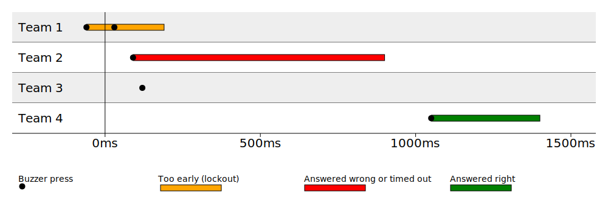

The X axis is time relative to when the human operator pressed the spacebar to indicate they were done reading the question out loud. Buzzes made before that are locked out for &frac14; second.

Each black dot represents a buzzer being pressed. Colored bars trailing the black dots show what the buzzer did. So in this example, from top to bottom:

- Team 1 pressed their buzzer before the operator pressed space, causing their buzzer to be locked out, indicated by the orange bar. Team 1 was then first to press their buzzer *after* the operator pressed space, beating team 2, but their buzzer was still locked out so the buzz did not do anything.
- Team 2 pressed their buzzer and were able to say an answer. The red bar indicates they either said an answer but it was wrong, or didn't say an answer in time.
- Team 3 pressed their buzzer while team 2 was answering so nothing happened.
- Team 4 pressed their buzzer, said their answer, and the green bar indicates they answered correctly.

The time scale can be zoomed in to see automatically-generated numerical annotations:

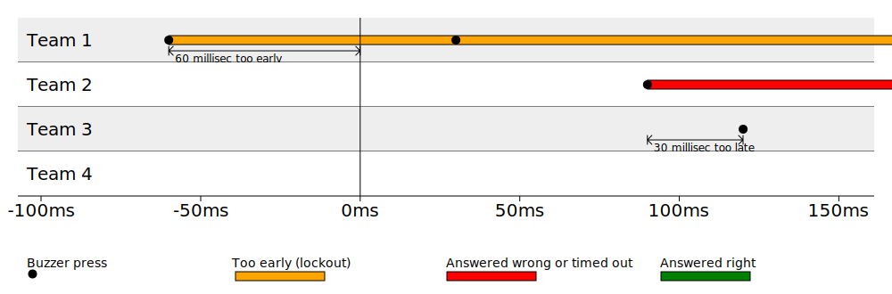

### Game-end statistics charts

At the end of each game, two charts let teams compare their gameplay. A line chart shows the rise and fall of each team's money, and a group of pie charts show how each team responded to the questions.

The charts below are from from an actual game played in early 2025:

<table>
  <tr>
    <td>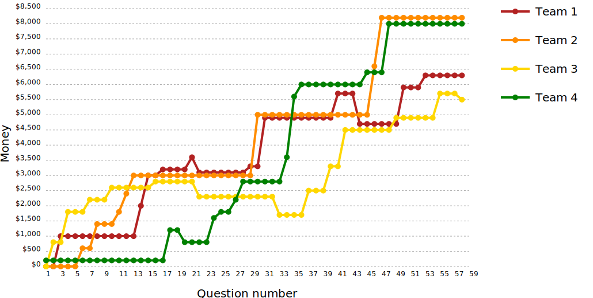</td>
    <td>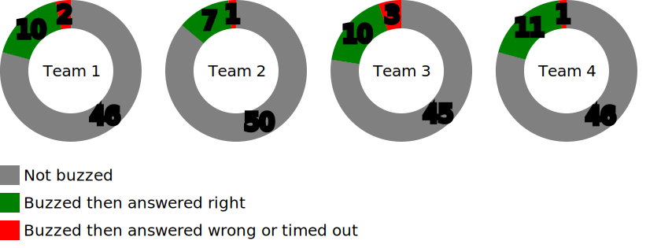</td>
    </tr>
</table>

The line chart captures the game's excitement: team 4 (green line) secured the first question but stagnated while team 2 (orange line) chased team 3's (yellow line) growth and surpassed it biefly only to be outdone by team 1's (red line) quick rise. In the midgame team 3's early foundation was eroded as teams 1 & 2 traded first place, then team 4 rocketed to the lead but team 2 soon followed to overtake them in the endgame.

The pie charts can quickly show whether the teams are balanced. To keep the game fun for everyone, I reshuffle team members if any team leading or lagging too much. These pie charts above show that this game was very well balanced (which is why I chose it to include here).

### Explanation of special categories

Some categories on the Jeopardy TV show have special meaning. For example, a category name with a word in quotation marks means all answers in that category contain the quoted word. Sometimes the TV show host explains these categories, but usually the players and audience are expected to already know them.

That means guests at my game who have seen the TV show may have an unfair advantage over players who are new to Jeopardy. To make the game more fair, my software detects special categories from [this list](https://list.fandom.com/wiki/Jeopardy!_recurring_categories), prompts the operator to show a popup to everyone, and provides an explanation with an example:

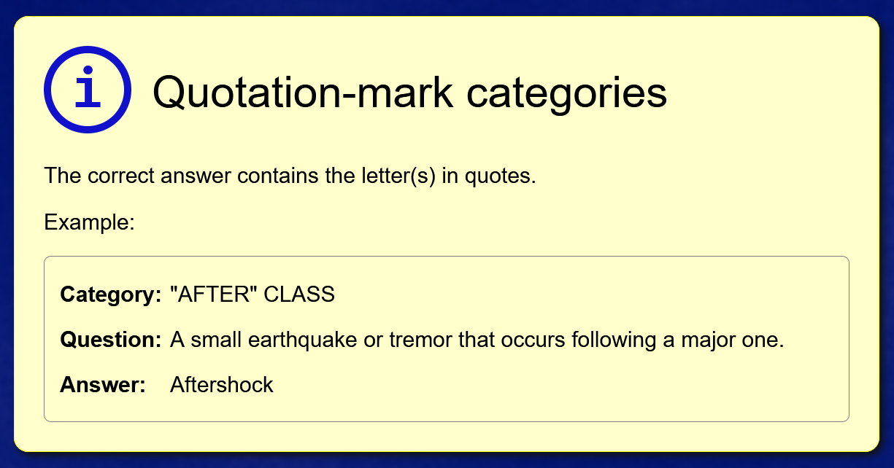

## "Clue" vs "question" vs "answer"

A *clue* contains a category, dollar value, question, and answer.

In the Jeopardy TV show, the host first reads an *answer* out loud then players must respond with a *question*, usually in the form "what is...?" but [not necessarily](https://www.jeopardy.com/jbuzz/behind-scenes/what-are-some-questions-about-jeopardy). When revealing Daily Double clues the host sometimes even [begins by saying "answer:..."](https://www.youtube.com/watch?v=kRCpZoVDx64).

That is confusing so in this project the naming convention is that the host reads a *question* out loud then players respond with an *answer*.

In summary:

<table>
  <tr>
    <th></th>
    <th>Host reads out loud</th>
    <th>Players respond with</th>
  </tr>
  <tr>
    <th>TV show</th>
    <td>answer</td>
    <td>question</td>
  </tr>
  <tr>
    <th>This project</th>
    <td>question</td>
    <td>answer</td>
  </tr>
</table>

## Known issues & future work

- The CSS uses hard-coded pixel sizes so the design is not responsive. Previously this was not a problem because I always ran the game on the same displays, and nobody else used this project. Starting in July 2025 it seems other people may be using this software so responsive design might become relevant.
